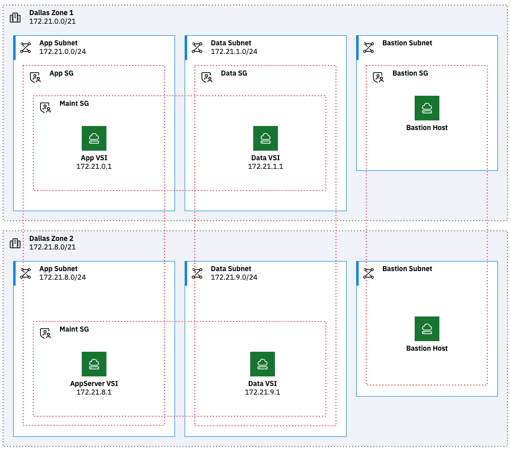

# ibmdiagrams

## Overview

Generate architecture diagrams following [IBM Diagram Standard](https://www.ibm.com/design/language/infographics/technical-diagrams/design).

Input can be Python or Terraform.

Output is a drawio file that can be opened and edited in drawio.

Icons are from the [icons repo](https://github.com/IBM-Cloud/architecture-icons) for use in any drawio desktop. 

Early release for testing - externals are subject to change.

Benefits

### Diagram as Code

* Easily create diagrams in Python to validate architectures.
* Quickly create and make changes without repositioning elements.
* Track changes and revert to previous versions as needed.
* Easily customized for other projects.

### Terraform

* Easily create diagrams of infrastructure provisioned with Terraform.
* Quickly come up-to-speed on complete environments.

Features

1. Shapes:
- Group (container=1) represents a deployedOn relationship (e.g. virtual server is deployedOn a subnet, see example).
- Zone (container=0) represents a deployedTo relationship (e.g. virtual server is deployedTo a security group, see example).
- Node (square shape) represent standalone components or devices.
- Actor (round shape) represent roles, functions or attributes played by human users, devices and other entities that interact with any of the above.

2. Selecting within non-containers:
- ibmdiagrams generates correct Z order autommatically.
- If needed, use alt-click or option-click to select shapes within non-containers, or define Z order by moving shapes backward.
3. Labels:
- ibmdiagrams enables the use of two labels on all shapes with a label that is SemiBold font and a sublabel (under label) that is regular font.
4. Fill colors:
- ibmdiagrams generates shapes with fill colors that are either white or a light color from same color family as the corresponding primary color (e.g. Cyan 50 is primary and fill is Cyan 10 or white).

## Guides

1. [Setup](docs/setup.md)
2. [Diagram as Code](docs/diagram-as-code.md)
3. [Terraform](docs/terraform.md)

---

# License

This application is licensed under the Apache License, Version 2.  Separate third-party code objects invoked by this application are licensed by their respective providers pursuant to their own separate licenses.  Contributions are subject to the [Developer Certificate of Origin, Version 1.1](https://developercertificate.org/) and the [Apache License, Version 2](https://www.apache.org/licenses/LICENSE-2.0.txt).

