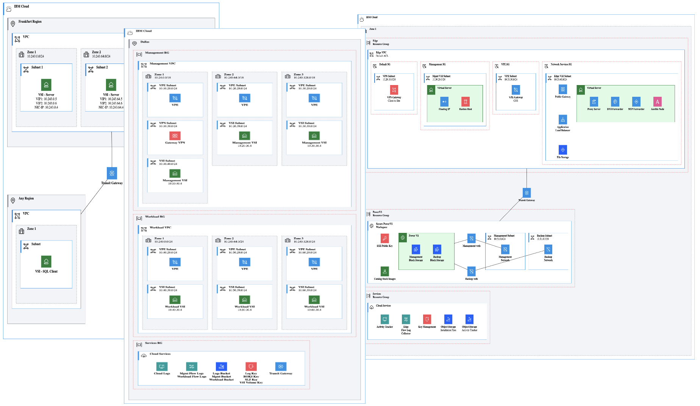

# ibmdiagrams

## Overview

Generate architecture diagrams following [IBM Diagram Standard](https://www.ibm.com/design/language/infographics/technical-diagrams/design).

Input is Python or Terraform with output to drawio file.

Python usage example:
- python cloud.py
- Output to  cloud.drawio

Terraform usage example:
- ibmdiagrams -h
- ibmdiagrams cloud.tfstate
- Custom output to cloud.drawio
<!--
- ibmdiagrams --general cloud.tfstate
- General output to cloud.drawio
-->

Refer to Guides for complete details.

Icons are from the [icons repo](https://github.com/IBM-Cloud/architecture-icons) for use in any drawio desktop. 

<b><i>Note: Early release for testing - externals are subject to change.</i></b>

Benefits

### Diagram as Code

* Easily create diagrams in Python to validate architectures.
* Quickly create and make changes without repositioning elements.
* Track changes and revert to previous versions as needed.
* Easily customized for other projects.

### Terraform

* Easily create diagrams of infrastructure provisioned with Terraform.
* Quickly come up-to-speed on existing environments.

Features

1. Diagrams generated by ibmdiagrams follow the [IBM Diagram Standard](https://www.ibm.com/design/language/infographics/technical-diagrams/design) using IBM Color Palette and IBM Plex Fonts.
2. Sidebars:
- ibmcloud is becoming hardened and less likely to change.
- ibmshapes if available is not hardened and likely to change.
3. Shapes:
- Group (container=1) represents a deployedOn relationship (e.g. virtual server is deployedOn a subnet).
- Zone (container=0) represents a deployedTo relationship (e.g. virtual server is deployedTo a security group).
- Node (square shape) represent standalone components or devices.
- Actor (round shape) represent roles, functions or attributes played by human users, devices and other entities that interact with any of the above.
4. Selecting within non-containers:
- ibmdiagrams generates correct Z order autommatically.
- If needed, use alt-click or option-click to select shapes within non-containers, or define Z order by moving shapes backward.
5. Labels:
- ibmdiagrams enables the use of two labels on all shapes with a label that is SemiBold font and a sublabel (under label) that is regular font using html: \<b style='font-weight:600'>label\</b>\ sublabel
- Users can also add \  tags in labels and sublabels for  additional lines.
- Group properties are generated according to how many lines are intended to ensure proper label placement, e.g. Labels with one, two, or three lines will be centered vertically in the 48 height of the group label, and greater than three lines will start at the top of the 48 height and continue downward.
6. Fill colors:
- ibmdiagrams generates shapes with fill colors that are either white or a light color from same color family as the corresponding primary color (e.g. Cyan 50 is primary and fill is Cyan 10 or white).
7. Connectors (in progress):
- Line styles can be solid, dashed, dotted, double, and tunnel are supported according to existing styles in drawio.
- Line ends can be arrow (filled or open), circle (filled or open), and diamond (filled or open).

Limitations

1. diagram-as-code in general does not have a mechanism for groups spanning other groups (e.g. in ibmdiagrams the same security group in two subnets has to be coded as two separate security groups with the same name) - improving this to some extent is a future consideration.  Similarly, manually creating diagrams can be problematic since all of the possible combinations can be difficult to represent.

2. Connectors are direct point-to-point with the plan to improve the layout and flexibility.  Similarly, manually creating connectors requires diligence to lay out connectors to not overlap and using properties such as edgeStyle=orthogonalEdgeStyle, etc.

## Guides

1. [Setup](docs/setup.md)
2. [Diagram as Code](docs/diagram-as-code.md)
3. [Terraform](docs/terraform.md)

---

# License

This application is licensed under the Apache License, Version 2.  Separate third-party code objects invoked by this application are licensed by their respective providers pursuant to their own separate licenses.  Contributions are subject to the [Developer Certificate of Origin, Version 1.1](https://developercertificate.org/) and the [Apache License, Version 2](https://www.apache.org/licenses/LICENSE-2.0.txt).

