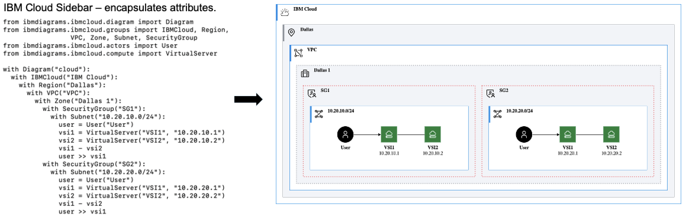
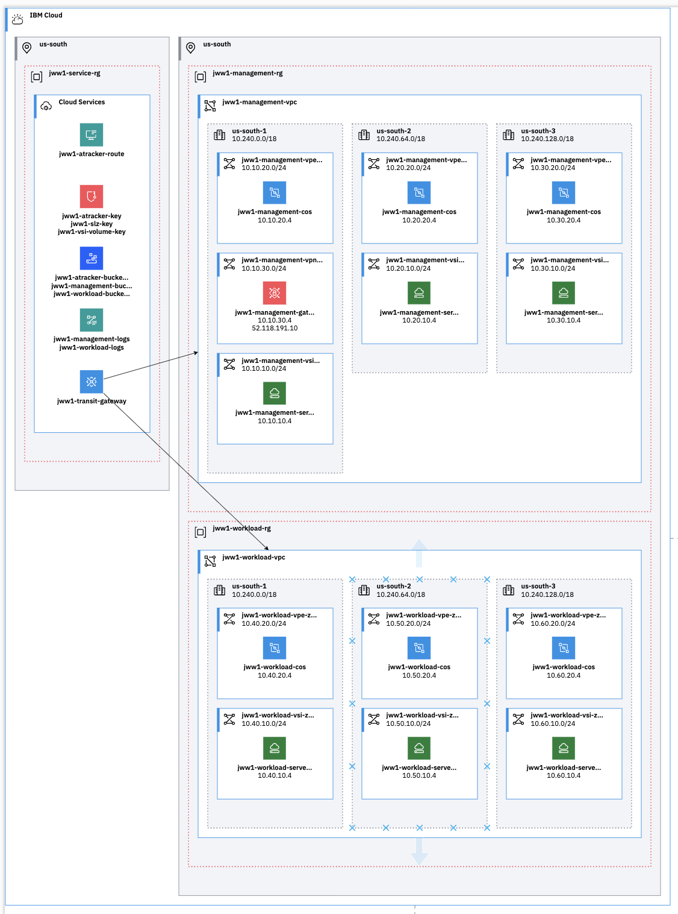

# Benefits

# Diagram as Code Benefits
* Easily create diagrams to validate architectures.
* Quickly create and make changes without repositioning elements.
* Track changes and revert to previous versions as needed.
* Easily customized for other projects.

# Diagram as Code Example

# Diagrams from Terraform Benefits
* Easily create diagrams of infrastructure provisioned with Terraform.
* Quickly come up-to-speed on complete environments.

## License

This application is licensed under the Apache License, Version 2.  Separate third-party code objects invoked by this application are licensed by their respective providers pursuant to their own separate licenses.  Contributions are subject to the [Developer Certificate of Origin, Version 1.1](https://developercertificate.org/) and the [Apache License, Version 2](https://www.apache.org/licenses/LICENSE-2.0.txt).
