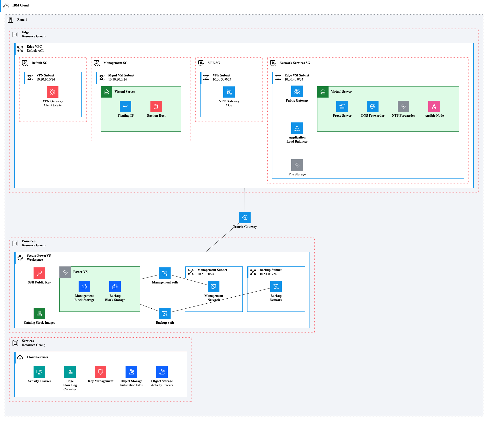

# Power Virtual Server with VPC Landing Zone

[Python Source](slzpowervs.py)

```{python}
from ibmdiagrams.ibmcloud.diagram import Diagram
from ibmdiagrams.ibmcloud.groups import IBMCloud, Region, VPC, Zone, Subnet, CloudServices, PowerWorkspace, ResourceGroup, SecurityGroup, ExpandedVirtualServer, ExpandedPowerVirtualServer
from ibmdiagrams.ibmcloud.actors import User, Application
from ibmdiagrams.ibmcloud.devops import Ansible
from ibmdiagrams.ibmcloud.compute import ImageService, PowerVirtualServer
from ibmdiagrams.ibmcloud.network import DNS, FIP, LB, NTP, NetworkInterface, ProxyServer, PublicGateway, TGW, VPE
from ibmdiagrams.ibmcloud.observability import CloudLogs, FlowLogs
from ibmdiagrams.ibmcloud.security import BastionHost, KeyProtect, SSHKey, VPN
from ibmdiagrams.ibmcloud.storage import BlockStorage, FileStorage, ObjectStorage

with Diagram("slzpowervs"):
  with IBMCloud("IBM Cloud"):
    with Zone("Zone 1", direction="TB"):
      with ResourceGroup("Edge<br>Resource Group"):
        with VPC("Edge VPC", "Default ACL") as vpc:
          with SecurityGroup("Default SG"):
            with Subnet("VPN Subnet", "10.20.10.0/24"):
              vpn = VPN("VPN Gateway", "Client to Site")
          with SecurityGroup("Management SG"):
            with Subnet("Mgmt VSI Subnet", "10.30.20.0/24"):
              with ExpandedVirtualServer("Virtual Server"):
                fip = FIP("Floating IP")
                bastion = BastionHost("Bastion Host")
          with SecurityGroup("VPE SG"):
            with Subnet("VPE Subnet", "10.30.30.0/24"):
              vpe = VPE("VPE Gateway", "COS")
          with SecurityGroup("Network Services SG"):
            with Subnet("Edge VSI Subnet", "10.30.40.0/24"):
              pg = PublicGateway("Public Gateway")
              alb = LB("Application<br>Load Balancer")
              file = FileStorage("File Storage")
              with ExpandedVirtualServer("Virtual Server"):
                proxy = ProxyServer("Proxy Server")
                dns = DNS("DNS Forwarder")
                ntp = NTP("NTP Forwarder")
                ansible = Ansible("Ansible Node")

      tgw = TGW("Transit Gateway")

      with ResourceGroup("PowerVS<br>Resource Group"):
        with PowerWorkspace("Secure PowerVS<br>Workspace", direction="TB") as power:
          sshkey = SSHKey("SSH Public Key")
          images = ImageService("Catalog Stock Images")
          with ExpandedPowerVirtualServer("Power VS") as powervsi:
            mgmtstorage = BlockStorage("Management<br>Block Storage")
            backupstorage = BlockStorage("Backup<br>Block Storage")
          mgmtnic = NetworkInterface("Management veth")
          backupnic = NetworkInterface("Backup veth")
          with Subnet("Management Subnet", "10.51.0.0/24"):
            mgmtsubnet = NetworkInterface("Management<br>Network")
          with Subnet("Backup Subnet", "10.51.0.0/24"):
            backupsubnet = NetworkInterface("Backup<br>Network")
          powervsi - mgmtnic - mgmtsubnet
          powervsi - backupnic - backupsubnet

      tgw - vpc
      tgw - power

      with ResourceGroup("Services<br>Resource Group"):
        with CloudServices("Cloud Services"):
          logs = CloudLogs("Activity Tracker")
          flowlogs = FlowLogs("Edge<br>Flow Log<br>Collector")
          keyprotect = KeyProtect("Key Management")
          objectstorage = ObjectStorage("Object Storage", "Installation Files")
          objectstoragelogs = ObjectStorage("Object Storage", "Activity Tracker")
```


</details>

## License

This application is licensed under the Apache License, Version 2.  Separate third-party code objects invoked by this application are licensed by their respective providers pursuant to their own separate licenses.  Contributions are subject to the [Developer Certificate of Origin, Version 1.1](https://developercertificate.org/) and the [Apache License, Version 2](https://www.apache.org/licenses/LICENSE-2.0.txt).
