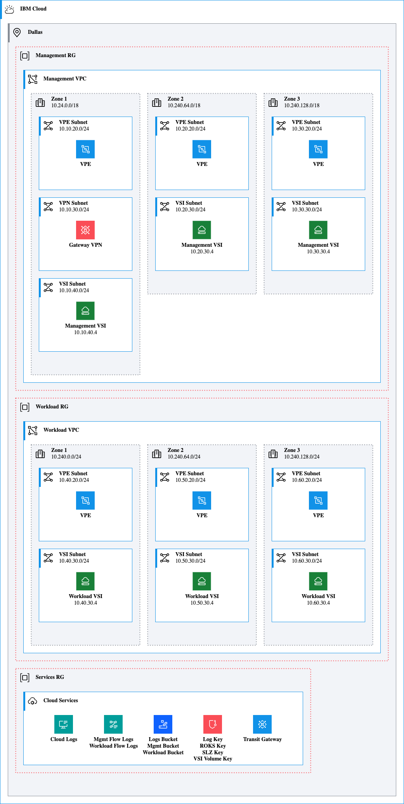

# VSI on VPC Landing Zone

[Python Source](slzvsi.py)

```{python}
from ibmdiagrams.ibmcloud.diagram import Diagram
from ibmdiagrams.ibmcloud.groups import IBMCloud, Region, VPC, Zone, Subnet, CloudServices, ResourceGroup, SecurityGroup
from ibmdiagrams.ibmcloud.compute import VirtualServer
from ibmdiagrams.ibmcloud.network import EndpointGateway, TransitGateway
from ibmdiagrams.ibmcloud.security import KeyProtect, VPNGateway 
from ibmdiagrams.ibmcloud.storage import ObjectStorage
from ibmdiagrams.ibmcloud.observability import CloudLogs, FlowLogs

with Diagram("slzvsi"):
  with IBMCloud("IBM Cloud"):
    with Region("Dallas", direction="TB"):
      with ResourceGroup("Management RG"):
        with VPC("Management VPC"):
          with Zone("Zone 1", "10.24.0.0/18", direction="TB"):
            with Subnet("VPE Subnet", "10.10.20.0/24"):
              vpe = EndpointGateway("VPE")
            with Subnet("VPN Subnet", "10.10.30.0/24"):
              vpn = VPNGateway("Gateway VPN")
            with Subnet("VSI Subnet", "10.10.40.0/24"):
              vsi = VirtualServer("Management VSI", "10.10.40.4")
          with Zone("Zone 2", "10.240.64.0/18", direction="TB"):
            with Subnet("VPE Subnet", "10.20.20.0/24"):
              vpe = EndpointGateway("VPE")
            with Subnet("VSI Subnet", "10.20.30.0/24"):
              vsi = VirtualServer("Management VSI", "10.20.30.4")
          with Zone("Zone 3", "10.240.128.0/18", direction="TB"):
            with Subnet("VPE Subnet", "10.30.20.0/24"):
              vpe = EndpointGateway("VPE")
            with Subnet("VSI Subnet", "10.30.30.0/24"):
              vsi = VirtualServer("Management VSI", "10.30.30.4")
      with ResourceGroup("Workload RG"):
        with VPC("Workload VPC"):
          with Zone("Zone 1", "10.240.0.0/24", direction="TB"):
            with Subnet("VPE Subnet", "10.40.20.0/24"):
              vpe = EndpointGateway("VPE")
            with Subnet("VSI Subnet", "10.40.30.0/24"):
              vsi = VirtualServer("Workload VSI", "10.40.30.4")
          with Zone("Zone 2", "10.240.64.0/24", direction="TB"):
            with Subnet("VPE Subnet", "10.50.20.0/24"):
              vpe = EndpointGateway("VPE")
            with Subnet("VSI Subnet", "10.50.30.0/24"):
              vsi = VirtualServer("Workload VSI", "10.50.30.4")
          with Zone("Zone 3", "10.240.128.0/24", direction="TB"):
            with Subnet("VPE Subnet", "10.60.20.0/24"):
              vpe = EndpointGateway("VPE")
            with Subnet("VSI Subnet", "10.60.30.0/24"):
              vsi = VirtualServer("Workload VSI", "10.60.30.4")
      with ResourceGroup("Services RG"):
        with CloudServices("Cloud Services"):
          logs = CloudLogs("Cloud Logs")
          flowlogs = FlowLogs("Mgmt Flow Logs<br>Workload Flow Logs")
          buckets = ObjectStorage("Logs Bucket<br>Mgmt Bucket<br>Workload Bucket")
          keys = KeyProtect("Log Key<br>ROKS Key<br>SLZ Key<br>VSI Volume Key")
          tg = TransitGateway("Transit Gateway")
```


</details>

## License

This application is licensed under the Apache License, Version 2.  Separate third-party code objects invoked by this application are licensed by their respective providers pursuant to their own separate licenses.  Contributions are subject to the [Developer Certificate of Origin, Version 1.1](https://developercertificate.org/) and the [Apache License, Version 2](https://www.apache.org/licenses/LICENSE-2.0.txt).
