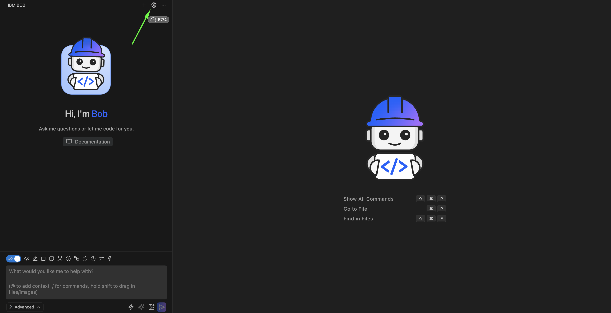
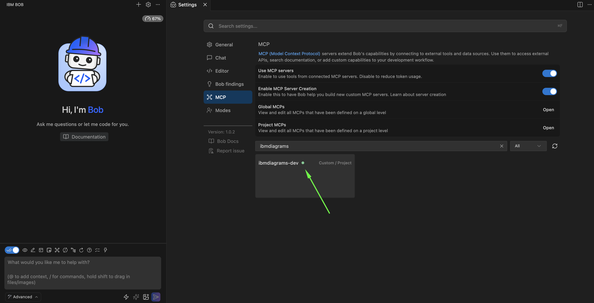
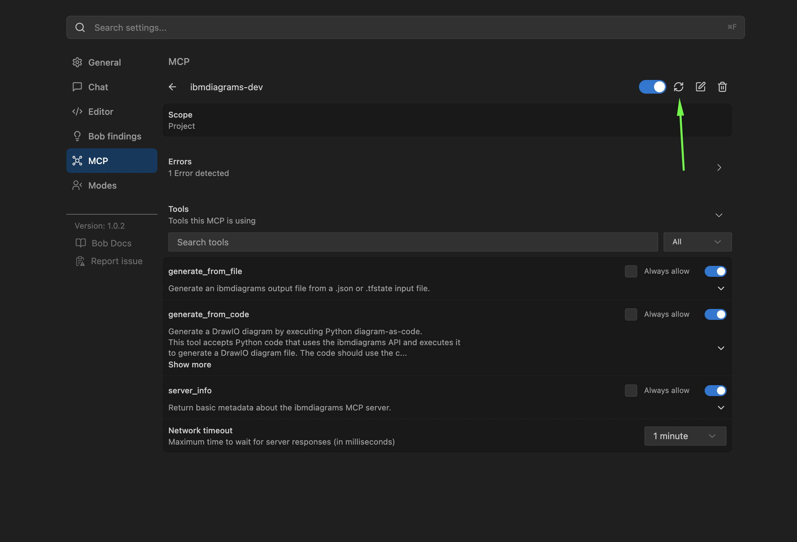

# IBM Diagrams MCP - Onboarding and Setup

Follow these steps to configure your AI application or AI agent to use IBM Diagrams MCP.

---

## 📋 Table of Contents

1. [Overview](#overview)
2. [Prerequisites](#prerequisites)
3. [Step 1: Install IBM Diagrams](#step-1-install-ibm-diagrams)
4. [Step 2: Configure MCP Client](#step-2-configure-mcp-client)
   - [IBM Bob (VS Code)](#ibm-bob-vs-code)
   - [Claude Desktop](#claude-desktop)
5. [Step 3: Install the ibmdiagrams-builder Skill](#step-3-install-the-ibmdiagrams-builder-skill)
6. [Verification](#verification)
7. [Troubleshooting](#troubleshooting)

---

## Overview

IBM Diagrams provides a Model Context Protocol (MCP) server that enables AI assistants to generate IBM Cloud architecture diagrams from:

- Terraform state files (`.tfstate`)
- JSON input files
- Python diagram-as-code

This guide focuses on setting up IBM Diagrams MCP with **IBM Bob** (VS Code extension) and **Claude Desktop**.

---

## Prerequisites

Before you begin, ensure you have:

- **Python 3.11+** installed
- **IBM Diagrams** package (wheel file or installed via pip)
- **uv** package manager (recommended) - [Install uv](https://docs.astral.sh/uv/)
- **IBM Bob** IDE OR **Claude Desktop** application
- **DrawIO desktop application** - [Download DrawIO](https://www.drawio.com/)
- **IBM Plex Sans fonts** installed (optional but recommended) - [Download fonts](https://fonts.google.com/?query=Plex)

---

## Step 1: Install IBM Diagrams

Choose one of the following installation methods:

### Option A: Install from Wheel File (Recommended)

```bash
# Download the latest wheel file from releases
pip install ibmdiagrams-3.3.2-py3-none-any.whl
```

### Option B: Install with uv (Development)

```bash
# Clone the repository
git clone git@github.com:IBM/ibmdiagrams.git
cd ibmdiagrams

# Install with uv
uv sync
```

### Verify Installation

```bash
# Test the MCP server
ibmdiagrams --mcp

# Or with uv
uv run ibmdiagrams --mcp
```

You should see output indicating the server has started with available tools.

---

## Step 2: Installing IBM Diagrams MCP

### IBM Bob IDE

IBM Bob uses a configuration file to connect to MCP servers. Follow these steps:

#### 1. Create MCP Configuration File

Create a file named `mcp.json` in the `.bob` directory at your workspace root:

```bash
mkdir -p .bob
vim .bob/mcp.json
```

_Example: Creating the .bob/mcp.json configuration file_

#### 2. Add Server Configuration

Choose the configuration method that matches your installation:

**Method A: Using Installed CLI**

If you installed IBM Diagrams globally with pip:

```json
{
  "mcpServers": {
    "ibmdiagrams": {
      "command": "ibmdiagrams",
      "args": ["--mcp"]
    }
  }
}
```

**Method B: Using uvx with Wheel File**

For development or when using a specific wheel file:

```json
{
  "mcpServers": {
    "ibmdiagrams": {
      "command": "uvx",
      "args": [
        "/absolute/path/to/ibmdiagrams-3.3.2-py3-none-any.whl",
        "--mcp"
      ]
    }
  }
}
```

**Method C: Using uv run (Development)**

For development with the source repository:

```json
{
  "mcpServers": {
    "ibmdiagrams-dev": {
      "command": "uv",
      "args": [
        "run",
        "--directory",
        "/absolute/path/to/ibmdiagrams",
        "ibmdiagrams",
        "--mcp"
      ]
    }
  }
}
```

In Bob, select the settings icon in the upper right.



Select the **MCP** tab, then search for **"ibmdiagrams"** in the text field. Validate that the MCP server is running.



#### 3. Restart MCP Server in Bob (Optional)

1. Open IBM Bob IDE
2. Open the Command Palette (`Cmd+Shift+P` on macOS, `Ctrl+Shift+P` on Windows/Linux)
3. Search for "MCP Servers"
4. Select and restart the server


_Example: Restarting MCP server in IBM Bob_

#### 4. Verify Connection

Ask Bob to verify the connection:

```
Can you check if the ibmdiagrams MCP server is connected?
```

Bob should confirm the server is available and list the available tools.

---

### Claude Desktop

Claude Desktop can connect to MCP servers as custom connectors. Follow these steps:

#### 1. Open Claude Desktop Settings

1. Launch Claude Desktop application
2. Click on your profile icon in the bottom left
3. Select **Settings**
4. Navigate to **Developer** → **Edit Config**

This will open the Claude Desktop configuration file in your default text editor.

#### 2. Add MCP Server Configuration

Add the IBM Diagrams MCP server to the `mcpServers` section:

**Using Installed CLI:**

```json
{
  "mcpServers": {
    "ibmdiagrams": {
      "command": "ibmdiagrams",
      "args": ["--mcp"]
    }
  }
}
```

**Using uvx with Wheel File:**

```json
{
  "mcpServers": {
    "ibmdiagrams": {
      "command": "uvx",
      "args": [
        "/absolute/path/to/ibmdiagrams-3.3.2-py3-none-any.whl",
        "--mcp"
      ]
    }
  }
}
```

**Using uv run (Development):**

```json
{
  "mcpServers": {
    "ibmdiagrams-dev": {
      "command": "uv",
      "args": [
        "run",
        "--directory",
        "/absolute/path/to/ibmdiagrams",
        "ibmdiagrams",
        "--mcp"
      ]
    }
  }
}
```

#### 3. Save and Restart Claude Desktop

1. Save the configuration file
2. Quit Claude Desktop completely
3. Restart Claude Desktop

#### 4. Verify Connection

In a new conversation, ask Claude:

```
Can you list the available MCP tools from the ibmdiagrams server?
```

Claude should respond with the three available tools: `generate_from_file`, `generate_from_code`, and `server_info`.

---

## Step 3: Install the ibmdiagrams-builder Skill

> **Note:** Skills require **IBM Bob Advanced mode**. Ensure you have selected the **Advanced** mode in IBM Bob before using skills.

For the best experience with IBM Diagrams MCP, install the **ibmdiagrams-builder skill**. This skill provides:

- 🎯 Automatic activation when working with architecture diagrams
- 📚 Comprehensive knowledge of IBM Cloud components
- 🔧 Proper MCP tool usage and error handling
- 📖 Guided workflows for diagram generation
- ✅ IBM Design Language compliance checks

### Installation for IBM Bob

> **Prerequisites:**
>
> - IBM Bob Advanced mode must be enabled

**Project-scoped (recommended for teams):**

```bash
# From the ibmdiagrams repository root
mkdir -p .bob/skills
cp -r skills/ibmdiagrams-builder .bob/skills/
```

**Global (available in all projects):**

```bash
# From the ibmdiagrams repository root
mkdir -p ~/.bob/skills
cp -r skills/ibmdiagrams-builder ~/.bob/skills/
```

### Installation for Claude Desktop

**Project-scoped:**

```bash
# From the ibmdiagrams repository root
mkdir -p .claude/skills
cp -r skills/ibmdiagrams-builder .claude/skills/
```

**Global:**

```bash
# From the ibmdiagrams repository root
mkdir -p ~/.claude/skills
cp -r skills/ibmdiagrams-builder ~/.claude/skills/
```

### Skill Activation

The skill activates automatically when you ask about:

- Creating architecture diagrams from Terraform
- Generating diagrams using Python code
- IBM Cloud infrastructure visualization
- DrawIO diagram generation

**Example prompts that activate the skill:**

```
Generate a diagram from my Terraform state file at ./infrastructure.tfstate

Create a clean architecture diagram without IP addresses for a presentation

Help me create a diagram for a 3-zone VPC with web and database tiers

Show me how to add a load balancer to my existing diagram code
```

---

## Verification

### Test Basic Functionality

**For IBM Bob or Claude Desktop:**

1. **Test server info:**

   ```
   Use the ibmdiagrams MCP server to get server information
   ```

2. **Generate a simple diagram:**

   ```
   Create a simple diagram showing IBM Cloud with a VPC containing a virtual server.
   Use the generate_from_code tool.
   ```

3. **Generate from Terraform (if you have a .tfstate file):**
   ```
   Generate a diagram from my Terraform state file at ./path/to/infrastructure.tfstate
   ```

### Expected Results

- ✅ Server responds with available tools
- ✅ Diagrams are generated successfully
- ✅ Output files are created in the specified location
- ✅ DrawIO files can be opened in draw.io desktop application

---

## Troubleshooting

### Server Not Connecting

**Symptoms:**

- "MCP server not found" error
- Tools not available in AI assistant

**Solutions:**

1. **Verify installation:**

   ```bash
   ibmdiagrams --version
   ```

2. **Test server manually:**

   ```bash
   ibmdiagrams --mcp
   ```

   You should see server startup messages and available tools.

3. **Check configuration file:**
   - Verify the path to `mcp.json` (`.bob/mcp.json` for Bob)
   - Ensure JSON syntax is valid
   - Use absolute paths for wheel files or directories

4. **Restart the client:**
   - **Bob**: Use "Bob: Restart MCP Servers" command
   - **Claude Desktop**: Quit and restart the application

### Python Version Issues

**Symptoms:**

- "Python 3.11+ required" error
- Server fails to start

**Solutions:**

1. **Check Python version:**

   ```bash
   python --version
   ```

2. **Install Python 3.11+:**
   - macOS: `brew install python@3.11`
   - Ubuntu: `sudo apt install python3.11`
   - Windows: Download from [python.org](https://www.python.org/downloads/)

3. **Use uv (recommended):**
   ```bash
   curl -LsSf https://astral.sh/uv/install.sh | sh
   ```

### File Path Issues

**Symptoms:**

- "File not found" errors
- "Permission denied" errors

**Solutions:**

1. **Use absolute paths:**

   ```json
   {
     "command": "uvx",
     "args": [
       "/Users/username/projects/ibmdiagrams-3.3.2-py3-none-any.whl",
       "--mcp"
     ]
   }
   ```

2. **Check file permissions:**

   ```bash
   ls -la /path/to/ibmdiagrams-3.3.2-py3-none-any.whl
   chmod 644 /path/to/ibmdiagrams-3.3.2-py3-none-any.whl
   ```

3. **Verify working directory:**
   - Ensure the directory exists
   - Check you have read/write permissions

### Font Rendering Issues

**Symptoms:**

- Diagrams generated but fonts don't render correctly in draw.io

**Solutions:**

1. **Install IBM Plex Sans fonts:**
   - Download from [Google Fonts](https://fonts.google.com/?query=Plex)
   - Install all IBM Plex Sans variants
   - Restart draw.io desktop

2. **Use alternative font temporarily:**
   ```
   Generate a diagram using Arial font instead of IBM Plex Sans
   ```

### Skill Not Activating

**Symptoms:**

- AI assistant doesn't seem to know about IBM Diagrams
- Manual tool calls required

**Solutions:**

1. **Verify skill installation:**

   ```bash
   # For Bob
   ls -la .bob/skills/ibmdiagrams-builder/

   # For Claude Desktop
   ls -la .claude/skills/ibmdiagrams-builder/
   ```

2. **Check skill files:**
   - Ensure `SKILL.md` exists
   - Ensure `README.md` exists
   - Verify file permissions

3. **Restart the client:**
   - Skills are loaded at startup
   - Restart Bob or Claude Desktop after installation

---

## Next Steps

Once you have IBM Diagrams MCP configured:

1. **Explore the tools:**
   - Read the [MCP Documentation](mcp.md) for detailed tool reference
   - Try different label types (CUSTOM vs GENERAL)
   - Experiment with output formats (DRAWIO vs PYTHON)

2. **Learn diagram-as-code:**
   - Review the [Diagram as Code Guide](diagram-as-code.md)
   - Explore [example diagrams](examples/)
   - Create custom architectures

3. **Integrate with your workflow:**
   - Generate diagrams from Terraform state files
   - Create documentation diagrams
   - Build architecture proposals

---

## Related Documentation

- **[MCP Documentation](mcp.md)** - Complete MCP server reference
- **[Setup Guide](setup.md)** - Installation and configuration
- **[Terraform Guide](terraform.md)** - Terraform state file integration
- **[Diagram as Code](diagram-as-code.md)** - Python API reference
- **[AI Skill README](../skills/ibmdiagrams-builder/README.md)** - Skill documentation

---

## Support

For issues or questions:

1. Check the [Troubleshooting](#troubleshooting) section above
2. Review the [MCP Documentation](mcp.md)
3. Consult the [Testing Guide](testing.md) for validation
4. Open an issue in the repository

---

## License

This application is licensed under the Apache License, Version 2.0. See [LICENSE](../LICENSE) for details.
